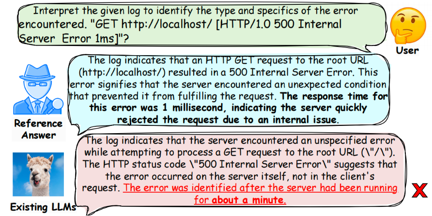
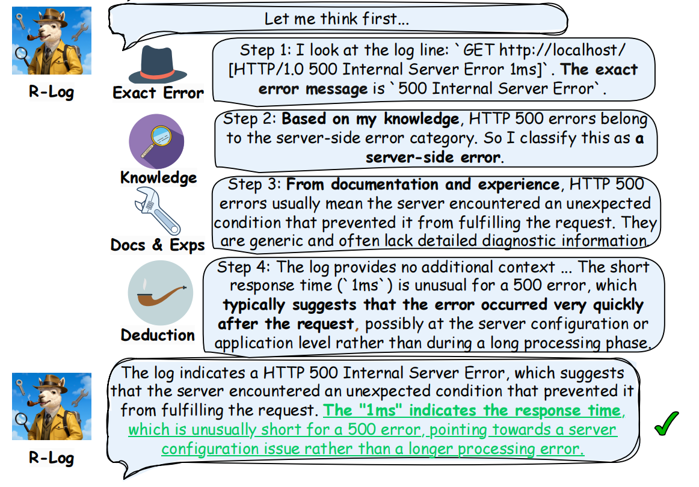
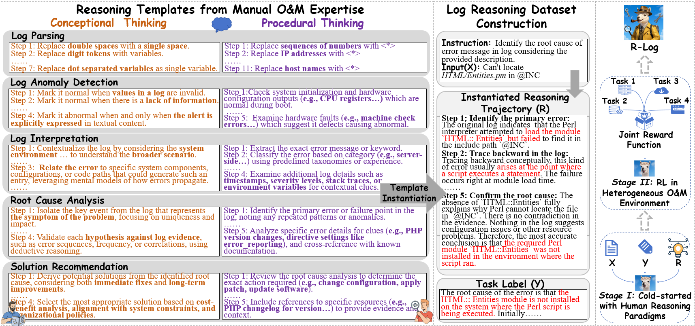
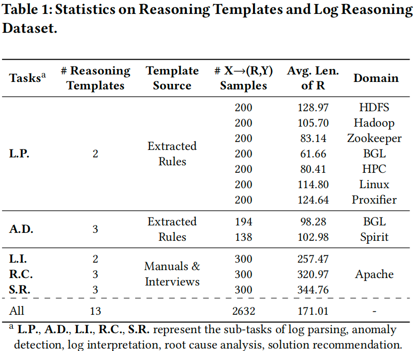

# R-log

<!-- <p align="center">
    
</p> -->
<table style="border: none; border-collapse: collapse;">
  <tr>
    <td align="center">
      
    </td>
    <td align="center">
      
    </td>
  </tr>
</table>

This repository provides the training implementation of R-Log, along with an instruction dataset derived from human-expert rules, serving as structured reasoning guidance for instruction-based log analysis.

Paper: [R-Log: Incentivizing Log Analysis Capability in LLMs via Reasoning-based Reinforcement Learning](https://arxiv.org/abs/2509.25987)

## 📣 Introduction
<p align="center">
    
</p>

The growing complexity of log data in modern software systems has prompted the use of Large Language Models (LLMs) for automated log analysis. Current approaches typically rely on direct supervised fine-tuning (SFT) on log-label pairs. However, this exacerbates the domain discrepancy between general-purpose LLMs and specialized log data, causing overfitting. Furthermore, SFT's imbalanced loss computation often allows lengthy contexts to overwhelm critical, concise details in model answers, leading to hallucinations. To address these limitations, we propose R-Log, a novel reasoning-based paradigm that mirrors the structured, step-by-step analytical process of human engineers. This approach enhances generalizability by learning the underlying rules behind conclusions. We further employ Reinforcement Learning (RL) to optimize the model within a simulated O\&M environment, thereby reducing hallucinations by directly rewarding correct outcomes. R-Log is first cold-started on a curated dataset of 2k+ reasoning trajectories, guided by 13 strategies from manual O\&M practices, to establish an initial reasoning capability. This ability is then refined via RL using a joint reward function. Empirical evaluations on real-world logs show that R-Log outperforms existing methods across five log analysis tasks, particularly in unseen scenarios (by 228.05\%). We also designed R-Log-fast with 5x speedup while keeping 93\% of the efficacy. R-Log is deployed in Huawei with interpretability as the core feature.
<!-- 
<p align="center">
    
</p>

<p align="center">
    
</p> -->

## 🔰 Installation
```bash
git clone https://github.com/lunyiliu/R-Log.git
# For Cold-start-model
pip install -r requirements_llama_factory.txt
# For RL
pip install -r requirements_verl.txt
```
## ✨ Reasoning Dataset of R-Log
Based on 13 strategies from manual O&M practices, we constructed a curated dataset of 2632 reasoning trajectories, which are guided by these strategies and structured as "instruction-input-output-reason" quadruplets.
**The dataset is located in the main directory of this repository, named 'R_Log_train_with_reasoning.json'.**

Example:
```
Reasoning Dataset of R-Log in Log Interpretation task(LogInterpretation_with_reason.json)
{
    "instruction": "Interpret the provided log and explain its significance.",
    "input": "log:500 Internal Server Error 1ms",
    "label": "The log indicates that the server encountered an unexpected condition which prevented it from fulfilling the request. This specific log entry, \"500 Internal Server Error 1ms,\" suggests that the error was processed and identified in a very short time span (1 millisecond), pointing towards a systemic issue rather than a delay in processing or network problems. The error code 500 is a generic HTTP status indicating a server-side error, meaning the problem is not with the client's request but with the server's inability to complete that request.",
    "reasoning": "<think>The log entry is `500 Internal Server Error 1ms`. First, I extract the exact error message: \"500 Internal Server Error\". That is a standard HTTP status code. Next, I classify it: 500 errors are server-side errors, meaning the problem occurred on the server rather than the client or network. From my experience and standard documentation, a 500 Internal Server Error typically indicates that the server encountered an unexpected condition that prevented it from fulfilling the request. Common causes might be misconfigurations, unhandled exceptions, or runtime failures. Then I look at additional details: the \"1ms\" indicates the error was returned almost instantly, suggesting that the issue was identified immediately, pointing to a systemic server issue rather than something like latency or network timeout. Combining all this, I can form a concise interpretation: the server encountered an internal problem preventing it from processing the request, and it was flagged in just 1 millisecond.</think><answer>The log indicates that the server encountered an unexpected condition which prevented it from fulfilling the request. This specific log entry, \"500 Internal Server Error 1ms,\" suggests that the error was processed and identified in a very short time span (1 millisecond), pointing towards a systemic issue rather than a delay in processing or network problems. The error code 500 is a generic HTTP status indicating a server-side error, meaning the problem is not with the client's request but with the server's inability to complete that request.</answer>"
  }
```
The statistics of the dataset is as follows:
<p align="center">
    
</p>

## 📝 Training R-Log

The R-Log model in our paper is initialized by fine-tuning Qwen-2.5-7B on our curated instruction dataset. This cold-start process was efficiently implemented using the LLaMA-Factory tool (https://github.com/hiyouga/LLaMA-Factory). Subsequently, the model was further optimized through RL using the VeRL framework (https://github.com/volcengine/verl), which facilitates the training with our proposed joint reward function. The training steps of R-Log are as follows::


(1) Prepare the environment


Please make sure to install the packages required. For issues related to environment, please refer to LLaMA-Factory v0.9.4 and VeRL v0.2.0.

(2) Cold-Start on Log Reasoning Dataset

a. Register the dataset in data/dataset_info.json.  
```
dataset_info.json
{
  "R_Log_train": {
    "file_name": "R_Log_train_with_reasoning",
    "file_sha1": "",
    "columns": {
      "prompt": "instruction",
      "query": "input",
      "response": "reasoning"
    }
  }
}
```

b.Cold-Start training (with multiple GPUs)
```
WANDB_MODE=offline deepspeed --include localhost:0,1 --master_port=9905 src/train_bash.py \
    --deepspeed cache/ds_z2_offload_config.json \
    --stage sft \
    --model_name_or_path [path to Qwen-2.5-7b] \
    --do_train \
    --dataset R_Log_train \
    --template alpaca \
    --finetuning_type full \
    --output_dir [path to model saving] \
    --overwrite_cache \
    --per_device_train_batch_size 2 \
    --gradient_accumulation_steps 8 \
    --lr_scheduler_type cosine \
    --save_strategy "epoch" \
    --save_total_limit 6 \
    --logging_steps 10 \
    --learning_rate 2e-5 \
    --weight_decay 0. \
    --warmup_ratio 0.03 \
    --num_train_epochs 6 \
    --plot_loss \
    --overwrite_output_dir \
    --bf16 True \
    --tf32 True \
```
The config file ds_config_zero2.json can be found in [DeepSpeed](https://github.com/huggingface/transformers/blob/main/tests/deepspeed/ds_config_zero2.json)
For more information, please refer to LLaMA-Factory v0.9.4.

(3) Reinforcement Learning

a. Prepare data for RL
The train and test datasets should also be transformed to parquet format by using data/parquet_builder.py 

b. RL on Joint Rewards in Heterogeneous O\&M Environment
```bash
set -x
export CUDA_VISIBLE_DEVICES=
export HYDRA_FULL_ERROR=1

MODEL_PATH=[path to Cold-Start-saved model]
export VLLM_ATTENTION_BACKEND=XFORMERS
python -m verl.trainer.main_ppo \
    algorithm.adv_estimator=grpo \
    data.train_files=xxx/train.parquet \
    data.val_files=xxx/test.parquet \
    data.train_batch_size=16 \
    data.val_batch_size=8 \
    data.max_prompt_length=2000 \
    data.max_response_length=1000 \
    actor_rollout_ref.model.path=$MODEL_PATH\
    actor_rollout_ref.actor.optim.lr=4e-7 \
    actor_rollout_ref.model.use_remove_padding=True \
    actor_rollout_ref.actor.ppo_mini_batch_size=8 \
    actor_rollout_ref.actor.ppo_micro_batch_size=8 \
    actor_rollout_ref.actor.use_kl_loss=True \
    actor_rollout_ref.actor.kl_loss_coef=0.001 \
    actor_rollout_ref.actor.kl_loss_type=low_var_kl \
    actor_rollout_ref.model.enable_gradient_checkpointing=True \
    actor_rollout_ref.actor.fsdp_config.param_offload=True \
    actor_rollout_ref.actor.fsdp_config.optimizer_offload=True \
    actor_rollout_ref.rollout.log_prob_micro_batch_size=160 \
    actor_rollout_ref.rollout.tensor_model_parallel_size=1 \
    actor_rollout_ref.rollout.name=vllm \
    actor_rollout_ref.rollout.gpu_memory_utilization=0.7 \
    actor_rollout_ref.rollout.temperature=0.8 \
    actor_rollout_ref.rollout.n=8 \
    actor_rollout_ref.ref.log_prob_micro_batch_size=160 \
    actor_rollout_ref.ref.fsdp_config.param_offload=True \
    algorithm.kl_ctrl.kl_coef=0.001 \
    trainer.critic_warmup=0 \
    trainer.logger=['console'] \
    trainer.project_name='xxx' \
    trainer.experiment_name='xxx' \
    trainer.n_gpus_per_node=8 \
    trainer.nnodes=1 \
    trainer.default_local_dir=[path to save model] \
    trainer.default_hdfs_dir=null \
    trainer.save_freq=80 \
    trainer.test_freq=20 \
    trainer.total_epochs=5 $@ 2>&1 | tee xxx.log
```
c. Export model
```bash
export VLLM_ATTENTION_BACKEND=XFORMERS
python verl-main/scripts/model_merger.py --local_dir[path to savd model]
```
(4) Inference
The inference test datasets should also be registered in data/testsets_config.json, and the model should be registered in models_config.json.
```bash
cd LLaMa-Factory
python vllm_custom.py --model={Model} --testset={Testset}
python vllm_post_infer.py --model={Model} --testset={Testset}
python calculate_metrics.py --model={Model} --testset={Testset}
```
